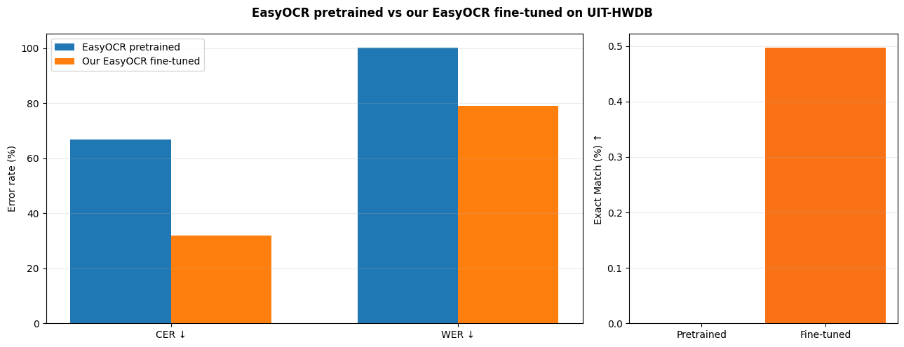
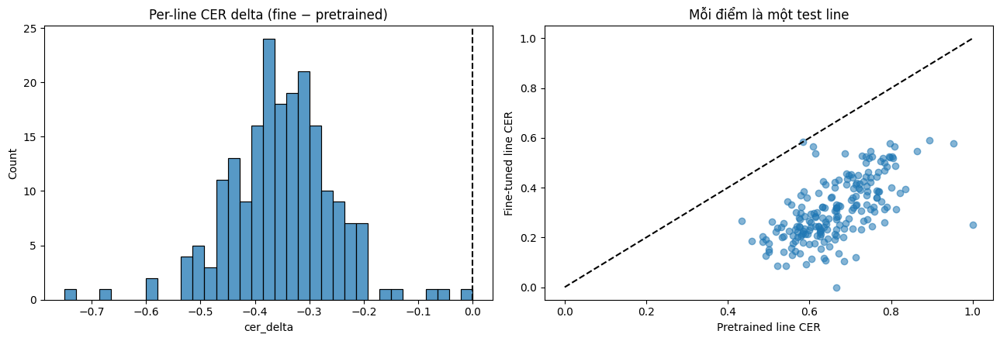
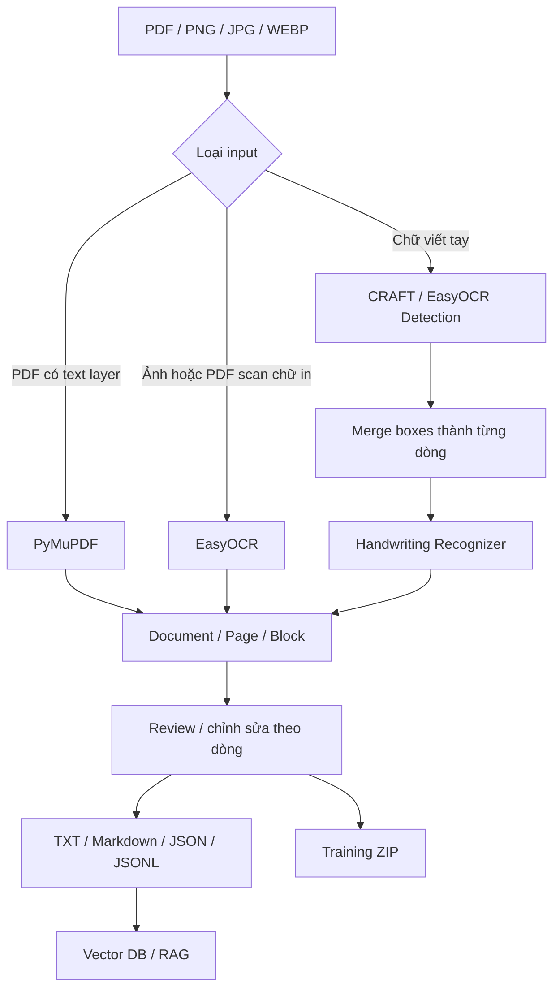

# VietDoc OCR

VietDoc OCR là ứng dụng OCR chạy local cho tài liệu tiếng Việt, hỗ trợ PDF có lớp văn bản, ảnh/PDF scan chữ in và chữ viết tay. Dự án dùng **PyMuPDF + EasyOCR + PyTorch**, có giao diện web local để kiểm tra bounding box, sửa kết quả OCR theo dòng, xuất TXT/Markdown/JSON/JSONL và chuẩn bị dữ liệu cho vector database / RAG.

Phần nghiên cứu chữ viết tay hiện dùng **EasyOCR Latin Gen2 (`latin_g2.pth`) làm baseline**, sau đó fine-tune recognizer trên **UIT-HWDB** bằng Kaggle T4. Đây là phép so sánh cùng kiến trúc, cùng decoder và cùng quy trình đánh giá: **EasyOCR pretrained → chính checkpoint đó sau fine-tune**.

> Mục tiêu của project là xây một pipeline OCR có thể kiểm tra, hiệu chỉnh và tái sử dụng dữ liệu — không giả định OCR chữ viết tay luôn chính xác 100%.

## Trạng thái hiện tại

- ✅ Pipeline OCR local: PDF text layer, printed OCR, review/edit, export.
- ✅ Experiment fine-tune EasyOCR trên UIT-HWDB đã chạy hoàn chỉnh.
- ✅ Best validation checkpoint của run 24 epoch đã được lưu.
- ✅ Notebook tạo package research, package deployment và experiment report.
- ⚠️ **Chỉ ghi "đã deploy model fine-tuned vào app" sau khi package `viet_handwriting.{pth,yaml,py}` được tích hợp vào runtime local.** Nếu branch hiện tại chưa thay loader handwriting, README này vẫn mô tả phần fine-tuning là research/deployment-ready chứ không khẳng định runtime đã dùng checkpoint mới.

---

## Demo

### 1. OCR PDF / tài liệu chữ in


### 2. OCR chữ viết tay


### 3. OCR vùng / một dòng


### 4. Training curves — EasyOCR fine-tuning

Biểu đồ theo dõi CTC loss và các metric validation trong quá trình fine-tune 24 epoch.


### 5. EasyOCR pretrained vs fine-tuned

So sánh trực tiếp EasyOCR Latin Gen2 pretrained với checkpoint fine-tuned trên cùng tập test đã lọc.



### 6. Paired error analysis

Phân tích theo từng sample để xem mức thay đổi CER sau fine-tuning và các trường hợp cải thiện / suy giảm.



---

## Tính năng chính

- Đọc trực tiếp **text layer của PDF** bằng PyMuPDF khi tài liệu đã có văn bản machine-readable.
- OCR ảnh/PDF scan chữ in Việt + Anh bằng **EasyOCR**.
- Detect text bằng **CRAFT / EasyOCR detector**.
- Gom các box gần nhau thành dòng trước khi nhận dạng chữ viết tay.
- Chế độ **Ảnh một dòng / OCR vùng** để bypass detector và đánh giá trực tiếp recognizer.
- Bounding box theo dòng, xem confidence, sửa nhãn thủ công và đánh dấu reviewed.
- Export **TXT / Markdown / JSON / JSONL / Training ZIP**.
- Chunk dữ liệu kèm metadata để dùng cho vector database / RAG pipeline.
- Fine-tuning **EasyOCR Latin Gen2 VGG-BiLSTM-CTC** trên Kaggle T4.
- Writer-disjoint train/validation split, image-hash leakage check, CER/WER/Exact Match và paired bootstrap confidence interval.
- Local-first: sau khi model đã có trên máy, luồng OCR không cần gọi API OCR bên ngoài.

---

## Kiến trúc

### Luồng OCR



### Handwriting recognizer

Research/deployment target hiện tại là custom EasyOCR recognizer:

```text
EasyOCR Latin Gen2 pretrained
        ↓
VGG FeatureExtraction
        ↓
2 × BiLSTM SequenceModeling
        ↓
CTC Prediction
```

Trong experiment hiện tại:

- giữ nguyên kiến trúc EasyOCR Latin Gen2;
- freeze `FeatureExtraction`;
- fine-tune `SequenceModeling` + `Prediction`;
- dùng CTC loss;
- chọn best checkpoint theo validation CER.

EasyOCR hỗ trợ custom recognition model bằng bộ ba file cùng basename:

```text
viet_handwriting.pth
viet_handwriting.yaml
viet_handwriting.py
```

### Fine-tuning workflow


---

## Dataset: UIT-HWDB

Experiment dùng public Hugging Face mirror:

- `blue7012/UIT_HWDB`
- language: Vietnamese
- license metadata: **CC-BY-4.0**
- fields: `image`, `text`, `writer_id`, `image_id`
- published mirror split:
  - train: **8,141 samples / 249 writers**
  - test: **232 samples / 6 writers**

Mirror này kết hợp **line-level và paragraph-level handwriting**, vì vậy notebook không giả định mọi sample đều là một dòng. Experiment lọc **line-like samples** bằng cùng policy đã khóa trong config:

```python
max_label_length = 160
min_aspect_ratio = 1.2
```

Sau filtering:

- published train được chia train/validation theo `writer_id` với seed 42;
- validation fraction: 10%;
- writer overlap giữa train/validation/test phải bằng 0;
- exact decoded-image duplicates được kiểm tra bằng SHA-256;
- published test chỉ được dùng ở giai đoạn đánh giá cuối;
- run hiện tại có **201 mẫu** trong filtered published-test subset.

Nguồn:

- Hugging Face mirror: https://huggingface.co/datasets/blue7012/UIT_HWDB
- UIT-HWDB original repository: https://github.com/nghiangh/UIT-HWDB-dataset
- Paper: *UIT-HWDB: Using Transferring Method to Construct A Novel Benchmark for Evaluating Unconstrained Handwriting Image Recognition in Vietnamese*, RIVF 2022.

Dataset gốc công bố:

| Subset | Số ảnh |
|---|---:|
| UIT-HWDB-word | 110,745 |
| UIT-HWDB-line | 7,273 |
| UIT-HWDB-paragraph | 1,144 |

### EDA của tập dữ liệu dùng cho experiment

Notebook có bước kiểm tra phân bố transcript length và aspect ratio trước khi train. Ảnh này giúp giải thích policy lọc `line-like samples` thay vì coi toàn bộ UIT-HWDB là dữ liệu một dòng.


---

## Experiment EasyOCR × UIT-HWDB

Notebook chính:

```text
notebooks/02-kaggle-finetune-easyocr-uit-hwdb.ipynb
```

Baseline:

```text
EasyOCR 1.7.2
latin_g2.pth
VGG-BiLSTM-CTC
```

Cấu hình run hiện tại:

```text
seed                = 42
validation fraction = 0.10
image size          = 64 × 1024
batch size          = 16
gradient accumulation = 2
effective batch     = 32
learning rate       = 3e-5
weight decay        = 1e-4
max epochs          = 24
early-stop patience = 3
GPU                 = Kaggle T4
```

### Model selection

Model selection chỉ dùng **validation CER**.

Run 24 epoch hiện tại:

| Checkpoint | Validation CER ↓ |
|---|---:|
| EasyOCR pretrained / epoch 0 | 61.40% |
| Best fine-tuned / epoch 24 | **21.25%** |

Validation CER giảm khoảng **40.16 điểm phần trăm**, tương đương khoảng **65.4% relative error reduction** so với pretrained baseline trên validation split của experiment này.

Best epoch 24 còn có:

```text
Validation WER         ≈ 58.68%
Validation Exact Match ≈ 0.72%
```

> **Không dùng các số test từ run 12 epoch cũ cho README.** Final test metrics của run 24 phải được lấy trực tiếp từ `comparison.json` trong `easyocr-experiment-report.zip` để tránh báo cáo số stale/sai run.

### Metric

- **CER — Character Error Rate:** càng thấp càng tốt.
- **WER — Word Error Rate:** càng thấp càng tốt.
- **Exact Match:** tỷ lệ sample đúng hoàn toàn, càng cao càng tốt.
- **Paired bootstrap 95% CI:** resample cùng test rows để ước lượng uncertainty của chênh lệch `fine-tuned - pretrained`.

Với CER/WER:

```text
delta < 0  → fine-tuned tốt hơn
```

Với Exact Match:

```text
delta > 0  → fine-tuned tốt hơn
```

---

## Artifact sinh ra sau training

Notebook tạo 3 package chính:

```text
easyocr-handwriting-research-finetuned.zip
easyocr-handwriting-deployment-selected.zip
easyocr-experiment-report.zip
```

### `easyocr-handwriting-research-finetuned.zip`

Checkpoint fine-tuned tốt nhất trong các epoch optimizer-updated. Dùng để lưu bằng chứng experiment, kể cả khi nó không phải checkpoint deploy cuối cùng.

### `easyocr-handwriting-deployment-selected.zip`

Checkpoint có validation CER tốt nhất giữa baseline và các epoch fine-tuned. Đây là package dùng để tích hợp local app.

Deployment layout:

```text
models/
└── easyocr/
    ├── viet_handwriting.pth
    └── user/
        ├── viet_handwriting.yaml
        └── viet_handwriting.py
```

EasyOCR custom model được khởi tạo theo API chính thức:

```python
import easyocr

reader = easyocr.Reader(
    ["vi", "en"],
    recog_network="viet_handwriting",
    model_storage_directory="models/easyocr",
    user_network_directory="models/easyocr/user",
    gpu=False,
)
```

### `easyocr-experiment-report.zip`

Report giữ các artifact phục vụ reproducibility, ví dụ:

```text
comparison.json
history.json
predictions / test outputs
error analysis
training / evaluation plots
provenance metadata
```

---

## Công nghệ

| Thành phần | Công nghệ |
|---|---|
| Backend | Python, FastAPI, Uvicorn |
| PDF text extraction | PyMuPDF |
| Printed OCR | EasyOCR |
| Handwriting detector | CRAFT / EasyOCR |
| Handwriting recognizer research | EasyOCR Latin Gen2 custom recognizer |
| Recognition architecture | VGG + BiLSTM + CTC |
| Training | PyTorch, AMP, AdamW, Kaggle T4 |
| Dataset pipeline | Hugging Face Datasets |
| UI | HTML, CSS, JavaScript |
| Evaluation | CER, WER, Exact Match, paired bootstrap CI |
| Vector export | JSONL, optional ChromaDB |

---

## Cấu trúc project

```text
vietdoc-ocr/
├── configs/                     # config/legacy experiment files nếu còn dùng
├── docs/
│   └── images/                  # ảnh demo / metric dùng trong README
├── examples/                    # input / output mẫu
├── models/                      # weights local, không commit mặc định
│   └── easyocr/
│       └── user/                # custom EasyOCR .yaml / .py
├── notebooks/
│   ├── 01_kaggle_finetune.ipynb                # legacy experiment
│   └── 02-kaggle-finetune-easyocr-uit-hwdb.ipynb
├── scripts/
├── tests/
├── training/                    # legacy/research utilities nếu còn dùng
├── vietdoc/
│   ├── core.py
│   ├── engines.py
│   ├── pipeline.py
│   ├── recognizer.py
│   ├── server.py
│   └── static/
├── pyproject.toml
├── README.md
└── .gitignore
```

---

## Cài đặt local trên Windows

### 1. Yêu cầu

- Windows 10/11
- Python **3.11 64-bit** khuyến nghị
- Git
- Internet cho lần cài dependency / tải model đầu tiên

### 2. Clone repository

```powershell
git clone https://github.com/taiiswibu/VietdocOCR_fine_tuning.git
cd VietdocOCR_fine_tuning
```

### 3. Tạo virtual environment

```powershell
py -3.11 -m venv .venv
.\.venv\Scripts\python.exe -m pip install --upgrade pip
```

### 4. Cài PyTorch CPU

```powershell
.\.venv\Scripts\python.exe -m pip install torch==2.5.1 torchvision==0.20.1 --index-url https://download.pytorch.org/whl/cpu
```

### 5. Cài dependency của project

```powershell
.\.venv\Scripts\python.exe -m pip install -e ".[ocr,train,test]"
```

### 6. Đặt custom handwriting model

Nếu dùng package deployment fine-tuned, giải nén và đặt:

```text
models/easyocr/viet_handwriting.pth
models/easyocr/user/viet_handwriting.yaml
models/easyocr/user/viet_handwriting.py
```

Theo EasyOCR, file `.pth`, `.yaml` và `.py` của custom recognizer phải cùng basename để có thể chọn bằng `recog_network`.

### 7. Chạy test

```powershell
.\.venv\Scripts\python.exe -m pytest -q
```

### 8. Chạy ứng dụng

```powershell
.\.venv\Scripts\python.exe -m vietdoc.cli serve
```

Mở:

```text
http://127.0.0.1:8000
```

---

## Cách sử dụng

### PDF có text layer

Chọn **Tự động / chữ in**. Nếu PDF có text layer, app ưu tiên PyMuPDF thay vì OCR.

### Ảnh / PDF scan chữ in

Dùng EasyOCR detector + recognizer chuẩn cho tài liệu in Việt/Anh.

### Chữ viết tay

Pipeline mục tiêu:

```text
Image / rendered PDF page
        ↓
CRAFT / EasyOCR detection
        ↓
merge fragments thành dòng
        ↓
crop từng dòng
        ↓
EasyOCR custom handwriting recognizer
        ↓
sort reading order
        ↓
review / correction
        ↓
text output
```

### OCR vùng / một dòng

Crop một dòng được đưa thẳng vào handwriting recognizer. Chế độ này giúp tách lỗi **detection/line grouping** khỏi lỗi **recognition**.

---

## Giới hạn

Kết quả notebook hiện tại đánh giá **recognizer trên line-like crops**. Nó chưa phải benchmark end-to-end cho toàn trang.

Chất lượng thực tế còn phụ thuộc vào:

- detector có tìm đúng vùng chữ không;
- thuật toán merge box có gom đúng từng dòng không;
- crop có cắt mất dấu tiếng Việt không;
- chữ nối nét / chữ nghiêng;
- handwriting style ngoài domain UIT-HWDB;
- blur, ánh sáng, perspective;
- giấy ô ly / đường nền;
- paragraph hoặc layout phức tạp.

Muốn báo cáo end-to-end detector + recognizer cần một tập ảnh trang có ground-truth bounding boxes / reading order phù hợp.

Vì vậy app vẫn giữ **human review + chỉnh sửa theo dòng** thay vì giả định OCR luôn chính xác 100%.

---

## Export dữ liệu

Ứng dụng hỗ trợ:

```text
TXT
Markdown
JSON
Chunks JSONL
Training ZIP
```

JSONL có thể làm đầu vào cho embedding/vector database. Nếu dùng ChromaDB:

```powershell
.\.venv\Scripts\python.exe -m pip install -e ".[vector]"
.\.venv\Scripts\python.exe scripts\import_vector.py workspace\sample\result.jsonl --query "nội dung cần tìm"
```

---

## Không commit dữ liệu nhạy cảm / artifact lớn

Nên giữ ngoài Git:

```text
.venv/
workspace/
data/
runs/
models/*.pth
models/**/*.pth
.env
```

Không push:

- token, API key, password;
- raw UIT-HWDB images hoặc cache dataset;
- Kaggle run directories;
- checkpoint `.pth` nếu chưa quyết định rõ cách phân phối;
- tài liệu OCR của người dùng;
- dữ liệu cá nhân hoặc tài liệu không có quyền công khai.

Không còn cần `HF_TOKEN` cho experiment UIT-HWDB public hiện tại.

---

## License & attribution

Source code của project theo license trong `LICENSE`.

Nguồn bên ngoài có license/điều khoản riêng:

- EasyOCR: https://github.com/JaidedAI/EasyOCR
- EasyOCR custom model guide: https://github.com/JaidedAI/EasyOCR/blob/master/custom_model.md
- UIT-HWDB public mirror: https://huggingface.co/datasets/blue7012/UIT_HWDB
- UIT-HWDB original dataset / citation: https://github.com/nghiangh/UIT-HWDB-dataset

Hugging Face mirror hiện khai báo **CC-BY-4.0**. Khi công bố kết quả, nên cite original UIT-HWDB paper và giữ provenance dataset revision/checkpoint SHA-256 trong report.

Xem thêm `NOTICE.md` trước khi phân phối model/data.
