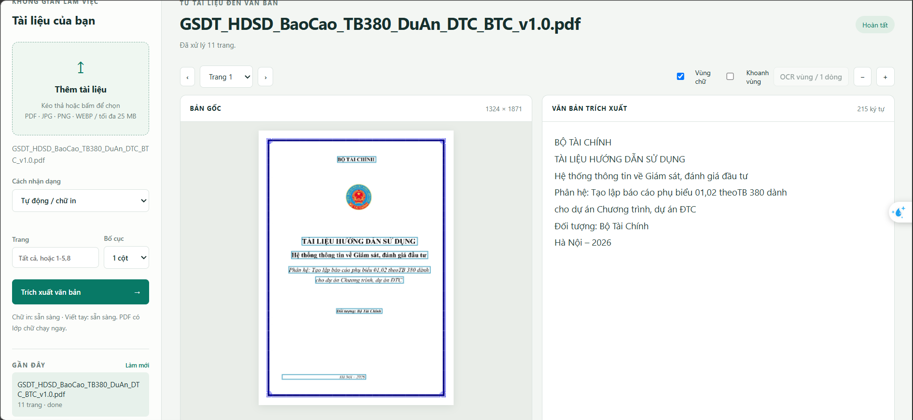
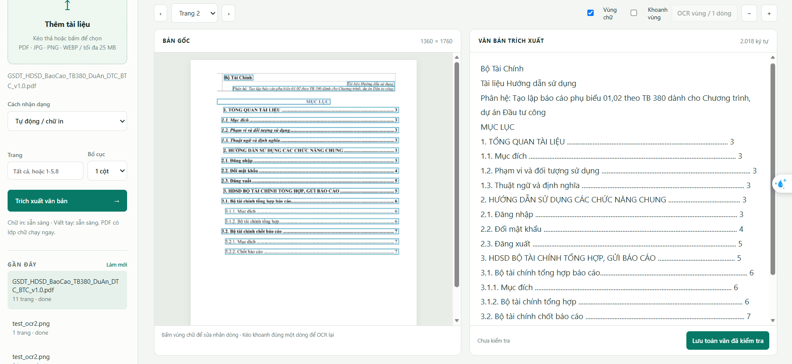
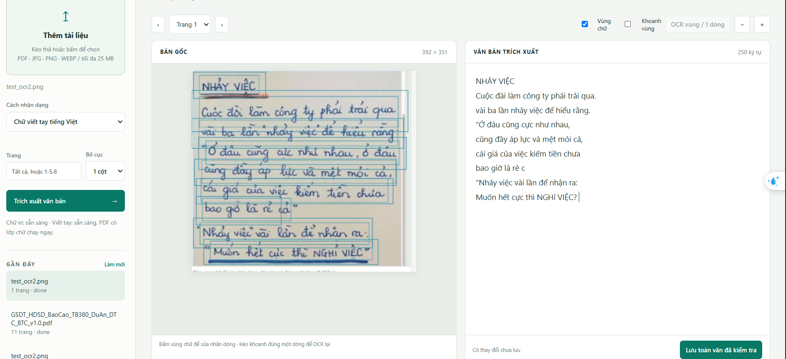
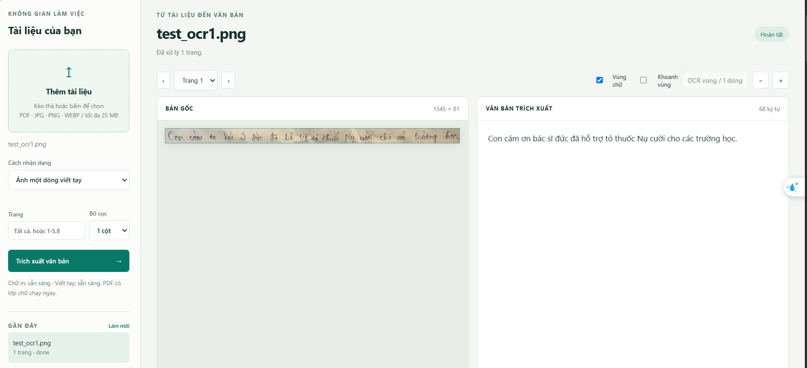
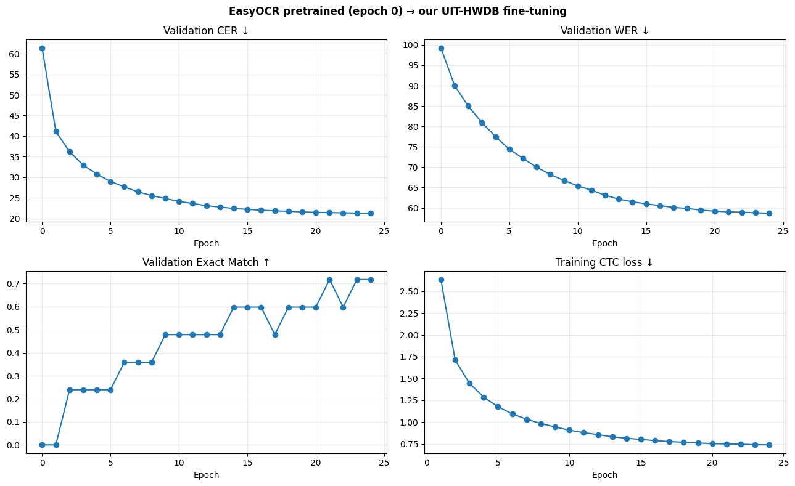
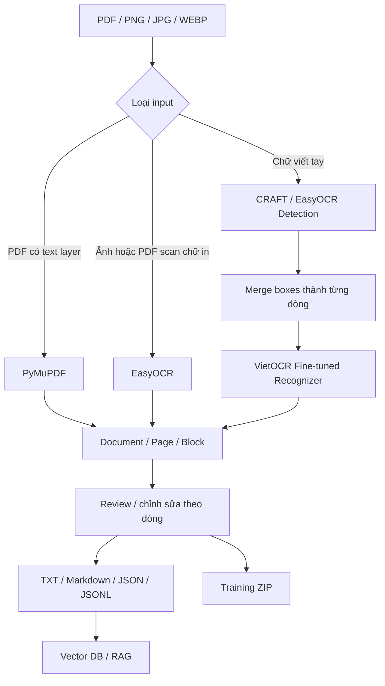
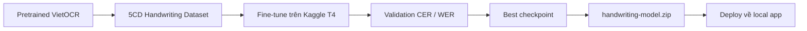

# VietDoc OCR


VietDoc OCR là ứng dụng OCR chạy local cho tài liệu tiếng Việt, hỗ trợ PDF có lớp văn bản, ảnh/PDF scan chữ in và chữ viết tay. Dự án kết hợp **PyMuPDF + EasyOCR + VietOCR**, có giao diện web local để kiểm tra bounding box, sửa kết quả OCR theo dòng, xuất TXT/Markdown/JSON/JSONL và chuẩn bị dữ liệu cho vector database.

Phần chữ viết tay sử dụng VietOCR và đã được **fine-tune trên Kaggle T4 với dataset 5CD**, sau đó checkpoint được đưa về ứng dụng local để inference.

> Mục tiêu của project là xây một pipeline OCR có thể kiểm tra, hiệu chỉnh và tái sử dụng dữ liệu — không giả định OCR chữ viết tay luôn chính xác 100%.

---

## Demo

### 1. OCR PDF / tài liệu chữ in




### 2. OCR chữ viết tay



### 3. OCR vùng / một dòng



### 4. Fine-tuning / đánh giá model



---

## Tính năng chính

- Đọc trực tiếp **text layer của PDF** bằng PyMuPDF khi tài liệu đã có văn bản machine-readable.
- OCR ảnh/PDF scan chữ in Việt + Anh bằng **EasyOCR**.
- OCR chữ viết tay bằng **CRAFT/EasyOCR detector + VietOCR recognizer**.
- Chế độ **Ảnh một dòng / OCR vùng** để bypass detector và đánh giá trực tiếp recognizer.
- Bounding box theo dòng, xem confidence, sửa nhãn thủ công và đánh dấu reviewed.
- Export **TXT / Markdown / JSON / JSONL / Training ZIP**.
- Chunk dữ liệu kèm metadata để dùng cho vector database / RAG pipeline.
- Fine-tuning VietOCR trên Kaggle T4 với train/validation/test, checkpoint/resume và CER/WER evaluation.
- Local-first: sau khi tải model, luồng OCR không cần gọi API OCR bên ngoài.
- Automated tests: **12 tests passed** trên bản project đã kiểm tra.

---

## Kiến trúc



### Fine-tuning workflow



---

## Công nghệ

| Thành phần | Công nghệ |
|---|---|
| Backend | Python, FastAPI, Uvicorn |
| PDF | PyMuPDF |
| Printed OCR | EasyOCR |
| Handwriting detector | CRAFT / EasyOCR |
| Handwriting recognizer | VietOCR, PyTorch |
| Fine-tuning | PyTorch, Kaggle T4 |
| Dataset pipeline | Hugging Face Datasets |
| UI | HTML, CSS, JavaScript |
| Evaluation | CER, WER, Exact Match |
| Vector export | JSONL, optional ChromaDB |

---

## Cấu trúc project

```text
vietdoc-ocr/
├── configs/                 # cấu hình VietOCR
├── docs/                    # architecture, Kaggle, validation, portfolio
│   └── images/              # ảnh demo dùng trong README
├── examples/                # input / output mẫu
├── models/                  # model local (weights không commit lên Git)
├── notebooks/               # notebook fine-tune Kaggle
├── scripts/                 # download model, package, compare metrics...
├── tests/                   # automated tests
├── training/                # prepare / train / evaluate
├── vietdoc/
│   ├── core.py
│   ├── engines.py
│   ├── pipeline.py
│   ├── recognizer.py
│   ├── server.py
│   └── static/
├── pyproject.toml
├── README.md
└── .gitignore
```

---

## Cài đặt local trên Windows

### 1. Yêu cầu

- Windows 10/11
- Python **3.11 64-bit** khuyến nghị
- Git
- Internet cho lần cài dependency / tải model đầu tiên

### 2. Clone repository

```powershell
git clone https://github.com/<YOUR_GITHUB_USERNAME>/vietdoc-ocr.git
cd vietdoc-ocr
```

### 3. Tạo virtual environment

```powershell
py -3.11 -m venv .venv
.\.venv\Scripts\python.exe -m pip install --upgrade pip
```

### 4. Cài PyTorch CPU

```powershell
.\.venv\Scripts\python.exe -m pip install torch==2.5.1 torchvision==0.20.1 --index-url https://download.pytorch.org/whl/cpu
```

### 5. Cài dependency của project

```powershell
.\.venv\Scripts\python.exe -m pip install -e ".[ocr,train,test]"
```

### 6. Tải model

```powershell
.\.venv\Scripts\python.exe scripts\download_models.py --all
```

> `models/` được `.gitignore` để tránh commit model weights lớn hoặc checkpoint có ràng buộc license. Nếu sử dụng checkpoint fine-tuned riêng, đặt `model.pth` và `config.yml` vào `models/handwriting/`.

### 7. Chạy test

```powershell
.\.venv\Scripts\python.exe -m pytest -q
```

### 8. Chạy ứng dụng

```powershell
.\.venv\Scripts\python.exe -m vietdoc.cli serve
```

Mở trình duyệt:

```text
http://127.0.0.1:8000
```

---

## Cách sử dụng

### PDF có text layer

Chọn **Tự động / chữ in**. Nếu PDF đã có text layer, app ưu tiên PyMuPDF thay vì OCR để tăng tốc và giữ độ chính xác.

### Ảnh / PDF scan chữ in

Chọn **Tự động / chữ in** hoặc **Buộc OCR chữ in Việt / Anh**. EasyOCR sẽ detect và recognize nội dung.

### Chữ viết tay

Chọn **Chữ viết tay**:

```text
Image
  -> CRAFT/EasyOCR detect text fragments
  -> merge fragments theo dòng
  -> crop từng dòng
  -> VietOCR fine-tuned
  -> sort reading order
  -> text output
```

### OCR vùng / một dòng

Khoanh đúng một dòng rồi chạy OCR vùng. Chế độ này đưa crop trực tiếp vào VietOCR và hữu ích để tách lỗi **detector** khỏi lỗi **recognizer**.

---

## Fine-tune VietOCR trên Kaggle T4

Notebook:

```text
notebooks/01_kaggle_finetune.ipynb
```

Pipeline:

```text
Pretrained VietOCR
        +
5CD Vietnamese handwriting dataset
        ↓
Training / validation trên Kaggle T4
        ↓
CER / WER evaluation
        ↓
Best checkpoint
        ↓
handwriting-model.zip
        ↓
Deploy về models/handwriting/
```

### Đánh giá

Các metric chính:

- **CER — Character Error Rate:** tỷ lệ lỗi theo ký tự, càng thấp càng tốt.
- **WER — Word Error Rate:** tỷ lệ lỗi theo từ, càng thấp càng tốt.
- **Exact Match:** tỷ lệ dòng được nhận dạng hoàn toàn chính xác, càng cao càng tốt.

Không đưa số benchmark vào README nếu chưa lấy từ chính run đã thực hiện. Có thể thêm ảnh biểu đồ thật vào `docs/images/training-metrics.png`.

---

## Kết quả và giới hạn

Fine-tuning giúp recognizer thích nghi tốt hơn với handwriting tiếng Việt, nhưng độ chính xác thực tế vẫn phụ thuộc vào:

- phong cách chữ viết của từng người;
- chữ nối nét / chữ nghiêng;
- dấu tiếng Việt nhỏ;
- chất lượng ảnh, ánh sáng, blur;
- giấy ô ly / đường nền;
- detector cắt hoặc gộp sai dòng;
- domain gap giữa dữ liệu fine-tune và ảnh ngoài thực tế.

Vì vậy ứng dụng hỗ trợ **human review + chỉnh sửa theo dòng** thay vì giả định OCR chữ viết tay luôn chính xác 100%.

---

## Export dữ liệu

Ứng dụng hỗ trợ:

```text
TXT
Markdown
JSON
Chunks JSONL
Training ZIP
```

JSONL có thể dùng làm đầu vào cho embedding/vector database. Project có script import ChromaDB tùy chọn:

```powershell
.\.venv\Scripts\python.exe -m pip install -e ".[vector]"
.\.venv\Scripts\python.exe scripts\import_vector.py workspace\sample\result.jsonl --query "nội dung cần tìm"
```

---

## Không commit các dữ liệu sau

`.gitignore` đã loại các thành phần quan trọng:

```text
.venv/
workspace/
data/
runs/
models/*
.env
```

Không push lên repository:

- `HF_TOKEN`, API key hoặc password;
- dataset 5CD gated;
- checkpoint/model nếu chưa kiểm tra license;
- tài liệu cá nhân hoặc tài liệu không có quyền công khai;
- file trong `workspace/` chứa OCR của người dùng.

Xem thêm `NOTICE.md` trước khi phân phối model/data.


---

## License & attribution

Source code của project có license trong `LICENSE`. Dataset/model bên ngoài có điều khoản riêng; xem `NOTICE.md` để biết nguồn và attribution. Dataset 5CD được sử dụng cho fine-tuning theo điều kiện truy cập/license của dataset.

---
